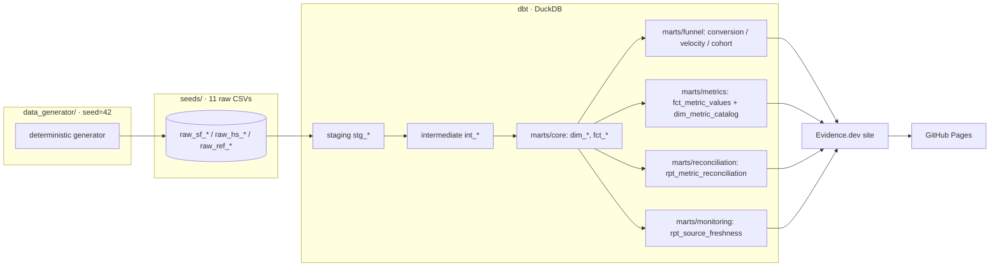

# Architecture

## Flow



Generate the live lineage graph + catalog locally:

```bash
dbt docs generate --profiles-dir profiles && dbt docs serve
```

## Layers

| Layer | Path | Materialization | Job |
|---|---|---|---|
| Seeds (raw) | `seeds/raw_*` (`seeds/_seeds.yml`) | table | 11 raw extracts; in production these become sources (see deploy doc) |
| Staging | `models/staging/stg_*` | view | 1:1 clean/rename/type, dedupe, resolve labels, flag defects |
| Intermediate | `models/intermediate/int_*` | view | Joins + business logic (crosswalk, lifecycle, spells, UTC) |
| Marts · core | `models/marts/core/` | table | Conformed dims + canonical facts (`fct_leads/mqls/opportunities/...`) |
| Marts · funnel | `models/marts/funnel/` | table | Conversion, stage velocity, cohort progression |
| Marts · metrics | `models/marts/metrics/` | table | `fct_metric_values` (one source per KPI) + `dim_metric_catalog` |
| Marts · reconciliation | `models/marts/reconciliation/` | table | The "which number is right?" showpiece |
| Marts · monitoring | `models/marts/monitoring/` | table | Source freshness vs SLA |

The contract `metrics_catalog.yml` (repo root) → `dim_metric_catalog` → `fct_metric_values`
is locked by `tests/assert_metric_values_match_catalog.sql`.

## DuckDB-first, Snowflake-portable

The repo builds on DuckDB so it clones and runs in seconds with no cloud account and runs
in CI. SQL is written to be portable; dialect-specific bits are isolated:

- **Timezone math** → `macros/to_utc.sql` (DuckDB `timezone()` vs Snowflake `convert_timezone()`).
- **Date math** → `dbt.datediff` / `dbt.date_trunc` / `dbt.dateadd` cross-db macros.
- **Percentiles** → `percentile_cont(...) within group` (portable to Snowflake).
- **Identifiers** → lower_snake_case throughout (Snowflake upper-cases unquoted names).

See [`DEPLOY_SNOWFLAKE.md`](./DEPLOY_SNOWFLAKE.md) for the production path.
